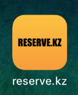

# iOS FootballPitch reserve.kz application 

This App was created for reserve football pitches which are located in Almaty region. So, I just wanna show how it looks by images.
<h2>1</h2><h3>Football Pitches search view</h3>

  

<h2>2</h2><h3>Football Pitches view</h3>

  

<h2>3</h2><h3>Reserve view</h3>

  

<h2>4</h2><h3>Calendar view</h3>

  

<h2>5</h2><h3>Map view with annotations</h3>

  

<h2>6</h2><h3>Map view with annotations and current location</h3>

  

<h2>7</h2><h3>Login View</h3>

  

<h2>8</h2><h3>Sign Up View</h3>

  

<h2>9</h2><h3>Account View</h3>

  

<h2>10</h2><h3>Edit Profile</h3>

  

<h2>11</h2><h3>Call view</h3>

  

